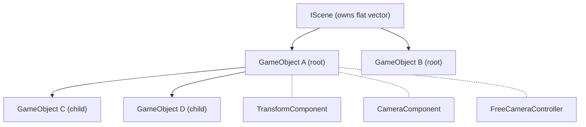
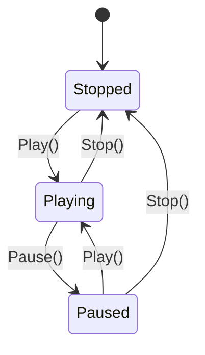
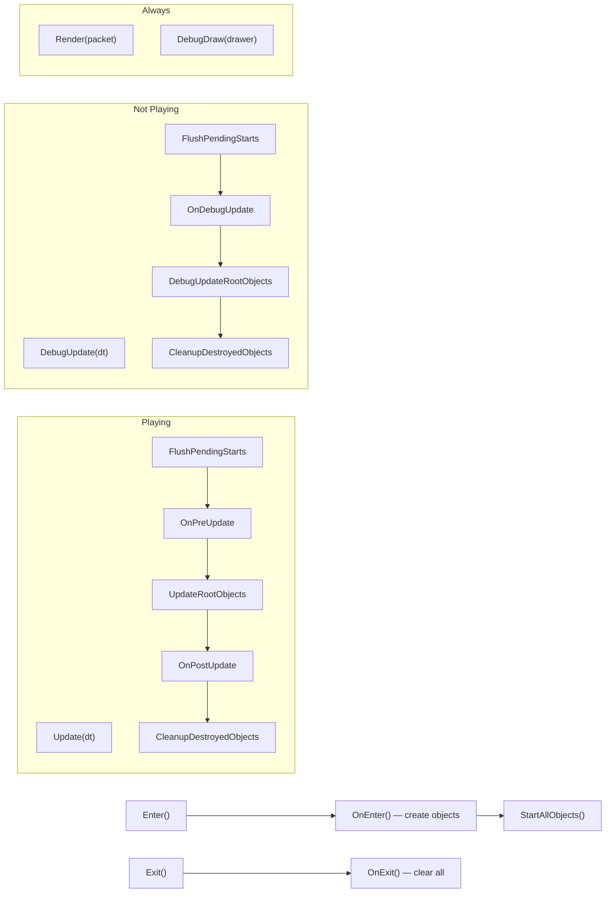
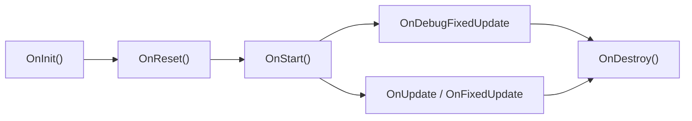

# Game Layer Architecture

## Dependency Direction

```
Application → Game → Graphic → Framework
```

Lower layers never depend on higher layers.

## Core Types

| Type | Role |
|------|------|
| `Game` | Top-level orchestrator. Owns `SceneManager`, `AssetManager`, `DebugDrawer`. Routes update/render per `PlayState`. |
| `GameContext` | Service locator. Holds non-owning pointers to shared systems. |
| `SceneManager` | Factory + loader. Registers scene types by `SceneKey`, handles deferred scene transitions. |
| `IScene` | Base class for scenes. Owns all `GameObject`s and manages their lifecycle. |
| `GameObject` | Entity node in the scene tree. Owns components and maintains parent/child hierarchy. Always has a `TransformComponent`. |
| `IComponentBase` | Base class for all components. Provides lifecycle hooks gated by `enabled` and `is_started`. |
| `Component<T>` | CRTP layer providing auto `GetTypeID()` / `GetTypeName()`. |
| `BehaviorComponent<T>` | Semantic alias for non-rendering logic components (scripts, controllers). |

## Terminology

### OnXXX vs XXX (e.g. OnUpdate vs Update)

`OnXXX` is the virtual hook for customization. `XXX` is the system method that orchestrates calls to `OnXXX`. For example, `GameObject::Update` calls `OnUpdate` on each component.

### Frame Packet

The per-frame rendering context. Constructed during `OnRender`, contains draw commands for all passes.

## GameContext (Service Locator)

```
GameContext
 ├─ InputSystem*      GetInput()
 ├─ Graphic*          GetGraphic()
 ├─ EventBus          GetEventBus()
 ├─ AssetManager*     GetAssetManager()
 ├─ DebugDrawer*      GetDebugDrawer()
 └─ SceneManager*     GetSceneManager()
```

`Game` populates the context at initialization. Access from any component:

```cpp
auto* input = GetContext()->GetInput();
```

## Scene Tree



- `IScene` stores all `GameObject`s in a flat `vector<unique_ptr<GameObject>>`.
- Parent/child hierarchy is maintained via `SetParent()` (pointers only, ownership stays in scene).
- Update/render traverses **root objects** and recurses into children.
- `active_ = false` skips the entire subtree.

## PlayState



| PlayState | Update Path | FixedUpdate Path |
|-----------|-------------|------------------|
| Playing | `OnUpdate` | `OnFixedUpdate` |
| Paused / Stopped | `OnDebugUpdate` | `OnDebugFixedUpdate` |

`OnRender` and `OnDebugDraw` run regardless of PlayState.

## Lifecycle

### Scene



`FixedUpdate` / `DebugFixedUpdate` follow the same pattern without `FlushPendingStarts` or `CleanupDestroyedObjects`.

### GameObject

```
Constructor          → auto-adds TransformComponent
Init()               → OnInit()
Start()              → OnStart() → FlushPendingStarts() for components
Update(dt)           → FlushPendingStarts → component OnUpdate → recurse children
FixedUpdate(dt)      → component OnFixedUpdate → recurse children
DebugUpdate(dt)      → FlushPendingStarts → component OnDebugUpdate → recurse children
DebugFixedUpdate(dt) → component OnDebugFixedUpdate → recurse children
Render(packet)       → component OnRender → recurse children
DebugDraw(drawer)    → component OnDebugDraw → recurse children
Destroy()            → marks self + children as pending destroy
~GameObject()        → OnDestroy() → component OnDestroy()
```

### Component



| Hook | When | Gating |
|------|------|--------|
| `OnInit` | `AddComponent` — immediate | — |
| `OnReset` | Before `OnStart`, and on `Stop()` | — |
| `OnStart` | First `FlushPendingStarts` | — |
| `OnUpdate` | Every frame | `enabled && started`, Playing |
| `OnFixedUpdate` | Fixed timestep | `enabled && started`, Playing |
| `OnDebugUpdate` | Every frame | `enabled && started`, Not Playing |
| `OnDebugFixedUpdate` | Fixed timestep | `enabled && started`, Not Playing |
| `OnRender` | Every frame | `enabled && started` |
| `OnDebugDraw` | Every frame | `enabled && started && debug_draw_enabled` |
| `OnDestroy` | `~GameObject` | `started` |
| `OnParentChanged` | `SetParent()` | — |

**Expected usage of each hook:**

- **`OnInit`** — Configure member defaults from constructor args. No sibling components are guaranteed to exist yet. Do not call `GetComponent<T>()` on siblings here.
- **`OnReset`** — Restore runtime state (velocity, timers, counters) back to initial values. Called both at first start and when the editor hits Stop. Should be idempotent.
- **`OnStart`** — Cache pointers to sibling components (`GetComponent<T>()`), subscribe to events, acquire external resources. All components on the same `GameObject` are guaranteed to be initialized.
- **`OnUpdate`** — Per-frame game logic: input handling, movement, AI decisions, animation state. Only runs during `Playing`.
- **`OnFixedUpdate`** — Fixed-timestep logic: physics integration, deterministic simulation. Only runs during `Playing`.
- **`OnDebugUpdate`** — Same as `OnUpdate` but runs when **not** Playing. Use for editor-time tools that need per-frame input (e.g. `FreeCameraController` delegates `OnDebugUpdate` → `OnUpdate`).
- **`OnDebugFixedUpdate`** — Same as `OnFixedUpdate` but runs when **not** Playing. Use for editor-time physics tools.
- **`OnRender`** — Submit draw data (meshes, sprites, particles) into `FramePacket`. Runs every frame regardless of PlayState. Do not put game logic here.
- **`OnDebugDraw`** — Submit debug visualization (wireframes, gizmos, bounding boxes) to `DebugDrawer`. Gated by `debug_draw_enabled` per component.
- **`OnDestroy`** — Unsubscribe from events, release resources. Called once during `~GameObject`, only if the component was started.
- **`OnParentChanged`** — React when the owning `GameObject`'s parent changes via `SetParent()`. Use for updating cached world-space values or re-registering with spatial structures.

## Object Creation & Destruction

**Creation** — `CreateGameObject` appends to `game_objects_` and calls `Init()` immediately. `Start()` is deferred to next `FlushPendingStarts()`. Objects created mid-frame are not updated until the next frame.

**Destruction** — `Destroy()` sets a flag. Actual removal happens in `CleanupDestroyedObjects()` at the end of `Update`/`DebugUpdate`. The container is never modified during iteration.
